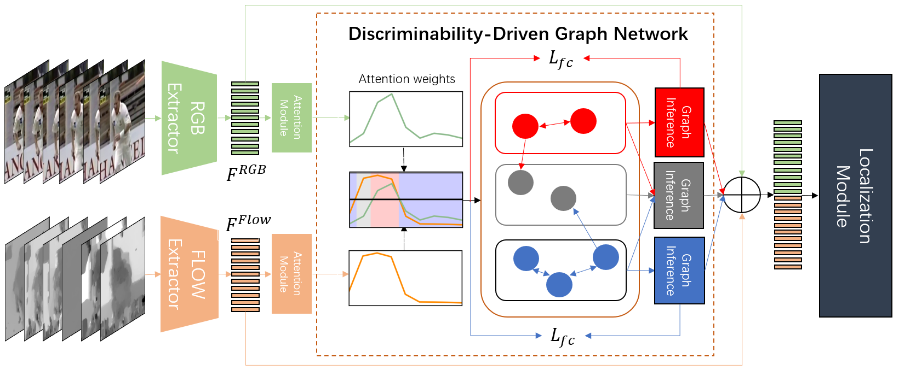

# DDG-Net: Discriminability-Driven Graph Network for Weakly-supervised Temporal Action Localization
[Paper](https://arxiv.org/abs/2307.16415)

Xiaojun Tang, Junsong Fan, Chuanchen Luo, Zhaoxiang Zhang, Man Zhang, and Zongyuan Yang

International Conference on Computer Vision(**ICCV**),2023

## Table of Contents
1. [Introduction](#introduction)
1. [Preparation](#preparation)
1. [Testing](#testing)
1. [Training](#training)
1. [Citation](#citation)

## Introduction
Weakly-supervised temporal action localization (WTAL) is a practical yet challenging task. Due to large-scale datasets, most existing methods use a network pretrained in other datasets to extract features, which is not suitable enough for WTAL. To address this problem, researchers design several enhance-feature modules, especially modeling the spatiotemporal relationship between snippets, and contribute to the performance of the localization module. However, all of them neglect the adverse effect of ambiguous snippets, which would reduce the discriminability of others. Considering this problem, we propose a graph network to explicitly model different snippets. Specially, we define pseudo-action snippets, pseudo-background snippets, and ambiguous snippets through simple judgments according to action weights. Based on them, we propose Discriminability-Driven Graph Network (DDG-Net) to spread complementary information between discriminative snippets and enhance the discriminability of ambiguous snippets through one-way acception. Additionally, we propose feature consistency loss to fully explore the ability of the graph convolution model and prevent the assimilation of features. Extensive experiments on THUMOS14 and ActivityNet1.2 benchmarks demonstrate the effectiveness of DDG-Net, establishing new state-of-the-art results on both datasets.



## Preparation
### Requirements and Dependencies:
Here we list our used requirements and dependencies.
 - Linux: Ubuntu 20.04.4 LTS
 - GPU: NVIDIA RTX A5000
 - CUDA: 11.7
 - Python: 3.8.10
 - PyTorch: 1.11.0
 - Numpy: 1.21.2
 - Pandas: 1.3.5
 - Scipy: 1.7.3 
 - Wandb: 0.12.11
 - Tqdm: 4.61.2

### THUMOS14 Dataset：
We use the 2048-d features provided by MM 2021 paper: Cross-modal Consensus Network for Weakly Supervised Temporal Action Localization. You can get access of the dataset from [here](https://rpi.app.box.com/s/hf6djlgs7vnl7a2oamjt0vkrig42pwho). The annotations are included within this package.

### ActivityNet-v1.2 Dataset：
We also use the features provided in [MM2021-CO2-Net](https://github.com/harlanhong/MM2021-CO2-Net). The features can be obtained from [here](https://rpi.app.box.com/s/hf6djlgs7vnl7a2oamjt0vkrig42pwho). The annotations are included within this package.

## Testing
Download the pretrained models from [Google Drive](https://drive.google.com/drive/folders/1ZcYKjZMPCp8aRNukyt8bZ0xYsMXYy7DM?usp=drive_link), and put them into "./download_ckpt/".

### Test on THUMOS-14
Change "path/to/thumos" in the script into your own path to the dataset, and run:
```
bash ./test_thumos.sh
```

### Test on ActivityNet-v1.2
Change "path/to/activity" in the script into your own path to the dataset, and run:
```
bash ./test_activitynet.sh
```

## Training
Change "path/to/thumos" into your own path to the dataset, and run:
```
bash ./train_thumos.sh
```

Change "path/to/activity" into your own path to the dataset, and run:
```
bash ./train_activity.sh
```

## Citation
If you find the code useful in your research, please cite:

    @InProceedings{Tang_2023_ICCV,
        author    = {Tang, Xiaojun and Fan, Junsong and Luo, Chuanchen and Zhang, Zhaoxiang and Zhang, Man and Yang, Zongyuan},
        title     = {DDG-Net: Discriminability-Driven Graph Network for Weakly-supervised Temporal Action Localization},
        booktitle = {Proceedings of the IEEE/CVF International Conference on Computer Vision (ICCV)},
        month     = {October},
        year      = {2023},
        pages     = {6622-6632}
    }

## License

See [MIT License](/LICENSE)

## Acknowledgement

This repo contains modified codes from:
 - [ECCV2022-DELU](https://github.com/MengyuanChen21/ECCV2022-DELU): for implementation of the baseline [DELU (ECCV2022)](https://www.ecva.net/papers/eccv_2022/papers_ECCV/papers/136640190.pdf).

This repo uses the features and annotations from:
 - [MM2021-CO2-Net](https://github.com/harlanhong/MM2021-CO2-Net): [CO2-Net (MM2021)](https://arxiv.org/abs/2107.12589).
